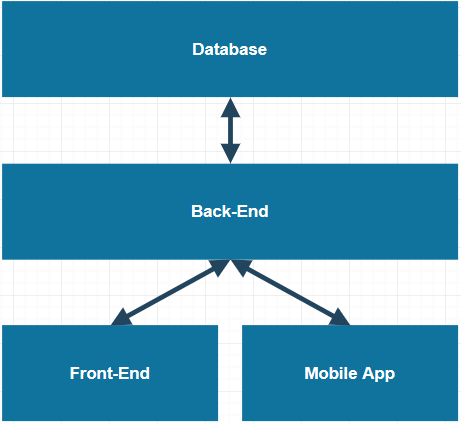
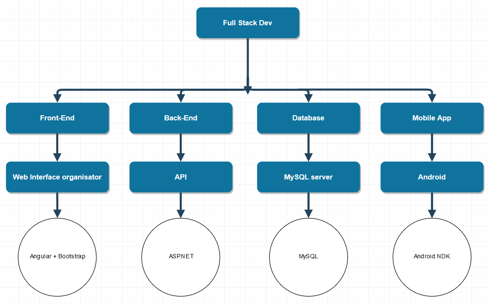

# Project Beschrijving
Na de brainstormsessie zijn wij met een concept gekomen om bezienswaardigheden in een stad op een leuke manier te ontdekken. Via een web interface kan je in het centrum van een stad naar keuze een spel opzetten. Ook kun je een van onze voor ingestelde spellen spelen van bekende steden. Het spel wordt gespeeld in groepen, je hebt minimaal 2 teams nodig om het spel te kunnen spelen.

Het idee is gebaseerd op ‘capture the flag’ wat je veel in video games ziet. Capture the flag houdt in dat je op een vastgesteld punt een bepaalde tijd moet staan om het te veroveren. Wij gaan dit doen met bezienswaardigheden binnen een bepaald gebied. Ga je met je groepje bij een bezienswaardigheid staan, dan wordt deze zogezegd van jou. wanneer je een punt veroverd hebt krijg je vragen en raadsels over het monument. Beantwoord je deze vragen goed dan wordt het moeilijker voor een ander team om het punt te veroveren. Dit is niet alleen om het spel wat moeilijker te maken, maar ook om wat bij te leren. Zo ligt de focus niet alleen op het veroveren van punten, maar ook op het bestuderen van de monumenten.

Via augmented reality kan je op willekeurige plekken op het monument hints/informatie vinden. Deze informatie kan je helpen met het oplossen van vragen of raadsels. Ook voor het vinden van de hint scoor je wat extra punten.
Op het einde van het spel wordt er gekeken naar wie de meeste monumenten bezit om zo de winnaar te bepalen. Als er een gelijkspel is wordt er gekeken naar welk team de meeste vragen in heeft opgelost.

Dus in het kort:
* Ga met je team bij een monument staan om deze te veroveren.
* Beantwoord vragen en los raadsels op om de capture sterker te maken.
* Verover zoveel mogelijk monumenten met je team.
* Gebruik augemented reality om hints te vinden en extra punten te scoren.

## Schema Architectuur

Communicatie systeem

Technologie en Software architectuur
